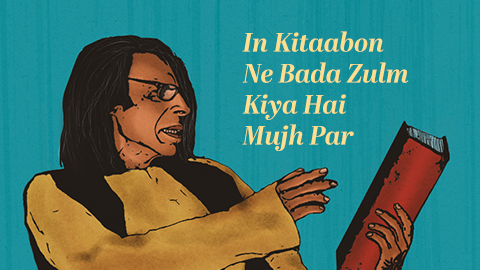

# Directory Listing

This is an autogenerated list of files and folders in the current directory.

## DB-Lectures

- [DBMS-Database-Triggers.pdf](./DB-Lectures/DBMS-Database-Triggers.pdf)
- [DBMS-Database-Views.pdf](./DB-Lectures/DBMS-Database-Views.pdf)
- [DBMS-Indexes.pdf](./DB-Lectures/DBMS-Indexes.pdf)
- [DBMS-Normalization-I.pdf](./DB-Lectures/DBMS-Normalization-I.pdf)
- [DBMS-Normalization-II.pdf](./DB-Lectures/DBMS-Normalization-II.pdf)
- [DBMS-Relational-Algebra.pdf](./DB-Lectures/DBMS-Relational-Algebra.pdf)
- [DBMS-Relational-Model-I.pdf](./DB-Lectures/DBMS-Relational-Model-I.pdf)
- [DBMS-Relational-Model-II.pdf](./DB-Lectures/DBMS-Relational-Model-II.pdf)
- [DBMS-SQL.pdf](./DB-Lectures/DBMS-SQL.pdf)

## French

- [French-Basics.pdf](./French/French-Basics.pdf)
- [French-Finals.pdf](./French/French-Finals.pdf)
- [french.md](./French/french.md)

## PD Lectures

- [Week-5.pdf](./PD Lectures/Week-5.pdf)
- [Week-6.pdf](./PD Lectures/Week-6.pdf)
- [Week-7.pdf](./PD Lectures/Week-7.pdf)
- [Week-9.pdf](./PD Lectures/Week-9.pdf)
- [Week-10.pdf](./PD Lectures/Week-10.pdf)
- [Week-11.pdf](./PD Lectures/Week-11.pdf)
- [Week-12.pdf](./PD Lectures/Week-12.pdf)
- [Week-13.pdf](./PD Lectures/Week-13.pdf)
- [Week-15 (1).pdf](./PD Lectures/Week-15 (1).pdf)
- [Week-15 (2).pdf](./PD Lectures/Week-15 (2).pdf)

## PT Lectures

- [Lecture-1.pdf](./PT Lectures/Lecture-1.pdf)
- [Lecture-2.pdf](./PT Lectures/Lecture-2.pdf)
- [Lecture-4-A.pdf](./PT Lectures/Lecture-4-A.pdf)
- [Lecture-4-B.pdf](./PT Lectures/Lecture-4-B.pdf)
- [Lecture-5-Final.pdf](./PT Lectures/Lecture-5-Final.pdf)
- [Lecture-6-Phish-Me-Not.pdf](./PT Lectures/Lecture-6-Phish-Me-Not.pdf)
- [Lecture-7.pdf](./PT Lectures/Lecture-7.pdf)
- [Lecture-8.pdf](./PT Lectures/Lecture-8.pdf)
- [Lecture-9.pdf](./PT Lectures/Lecture-9.pdf)

## Web Lectures

- [Lecture 10 - Injecting OS Commands.pdf](./Web Lectures/Lecture 10 - Injecting OS Commands.pdf)
- [Lecture 11 - XSS.pdf](./Web Lectures/Lecture 11 - XSS.pdf)
- [Lecture 12 - Attacking Users.pdf](./Web Lectures/Lecture 12 - Attacking Users.pdf)
- [Lecture 8 - Data store.pdf](./Web Lectures/Lecture 8 - Data store.pdf)
- [Lecture-1.pdf](./Web Lectures/Lecture-1.pdf)
- [Lecture-2.pdf](./Web Lectures/Lecture-2.pdf)
- [Lecture-3.pdf](./Web Lectures/Lecture-3.pdf)
- [Lecture-4.pdf](./Web Lectures/Lecture-4.pdf)
- [Lecture-5.pdf](./Web Lectures/Lecture-5.pdf)

_Last Updated on 2025-01-07 12:01:56_

# Testing Repository

**Disclaimer: This repository is STRICTLY for testing purposes ONLY. Any content contained within it is ABSOLUTELY not to be considered as final or production-ready. I do not take any responsibility or ownership of anything in this repository.**

<!--  

  

 -->
